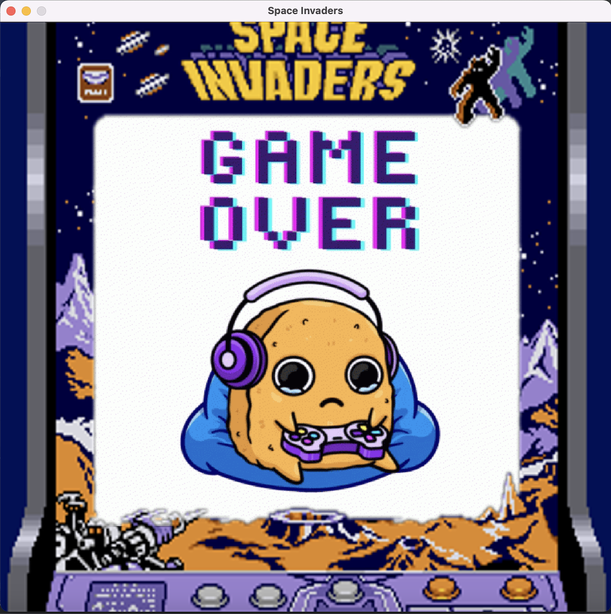

# Java Space Invaders
Java Space Invaders game clone source code 

http://zetcode.com/javagames/spaceinvaders/

This is the first version of the game.

We've improved this game

## Level 1

 
In the first level we start with a group of green aliens. Each of these aliens has 2 lives. The movement of the aliens is as follows; they move to the right or left and if they hit the corner, they move downwards. 
 
The player also has 2 lives. If the player kills all the aliens, he will move to the second level.

## Level 2

  

 
When we get to the second level, our alien group changes. The new aliens have 3 lives and move faster. There are also more aliens. 
 
The player has 3 lives and can send 2 bullets at once.
 
If the player kills all the aliens, they will advance to level 3.

## Level 3

  

  

  
There is a boss in the last level. This boss has 200 health. The boss can only move left and right, not downwards. It sends a rapid fireball at regular intervals. It also sends a group of aliens if the player shoots too often. These aliens move as in the previous levels and their goal is to reach the ground. 
 
The player has 4 lives and can send 3 bullets at once. If he kills the boss, he <b>wins</b> the game.
   

## How do you lose in the game?
 

- If the player collides with any alien, the game ends immediately.
- If the player collides with a bomb sent by the aliens, his/her health is reduced by 1 and if the player runs out of health completely, <b>the game ends.</b>
- <b>If the aliens reach the ground, the invasion starts and the game ends.</b>

## Game Controls

<b>Movement: </b> direction keys
 
<b>Shoot: </b> space key

